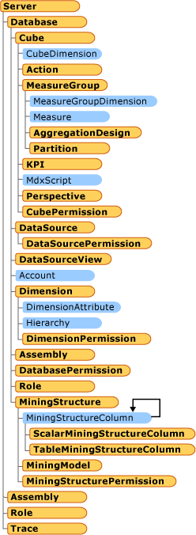

# AMO Classes

[!INCLUDE[appliesto-sqlas-aas](../includes/appliesto-sqlas-aas.md)]

  Analysis Management Objects (AMO) is a library of classes designed to manage an Analysis Services instance from a client application. You use AMO classes to administer Analysis Services objects such as databases, dimensions, cubes, mining structures and models, roles and permissions, exceptions, and others  
  
 The following illustration shows the relationship of the classes:  
  
   
  
 The AMO library can be thought of as logically-related groups of objects that are used to accomplish a specific task. AMO classes can be categorized in the following way. This section includes the following topics:  
  
|Topic|Description|  
|-----------|-----------------|  
|[AMO Fundamental Classes](amo-fundamental-classes.md)|Describes classes that are required in order to work with any other set of classes.|  
|[AMO OLAP Classes](amo-olap-classes.md)|Describes classes that let you manage the OLAP objects.|  
|[AMO Data Mining Classes](amo-data-mining-classes.md)|Describes classes that let you manage the data mining objects.|  
|[AMO Security Classes](amo-security-classes.md)|Describes classes that let you control access to other objects and maintain security.|  
|[AMO Other Classes and Methods](amo-other-classes-and-methods.md)|Describes classes and methods that help OLAP or Data Mining administrators to complete their daily tasks.|  
