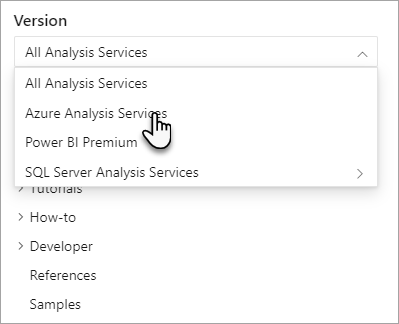

# Understanding Analysis Services documentation

[!INCLUDE[ssas-appliesto-sqlas-all-aas-pbip](../includes/ssas-appliesto-sqlas-all-aas-pbip.md)]

If you're using Azure Analysis Services, SQL Server Analysis Services, or Power BI Premium datasets, this article will help you understand and find the documentation you are looking for.

## One engine - three platforms

Analysis Services provides enterprise grade semantic modeling, governance, lifecycle, and data management on three different platforms: the cloud in **Azure**, on-premises with **SQL Server**, and under the hood the Analysis Services engine powers **Power BI Premium** workspaces and datasets. This presents a unique challenge where some Analysis Services documentation applies to only one platform, like Azure Analysis Services, or applies to all platforms, including Power BI Premium. For example, how you provision an Analysis Services resource in Azure is quite different from how you create a server instance in SQL Server Analysis Services. On the other hand, how you use Visual Studio to create and deploy a tabular model project, or how SQL Server Profiler is used to capture data about process events in the Analysis Services engine are much the same, regardless of platform.

All Analysis Services documentation, regardless of platform, exists in [Microsoft Docs](https://docs.microsoft.com/) (docs.microsoft.com). To reduce redundancy, where possible, articles that apply to more than one platform are included here in the *shared* Analysis Services documentation. Documentation specific to Azure Analysis Services or Power BI Premium are in other places on Microsoft Docs.

### Azure Analysis Services

If you're using Azure Analysis Services, it's best to start with [Azure Analysis Services documentation](https://docs.microsoft.com/azure/analysis-services/). This is where you can learn about Analysis Services' specific implementation in Azure. For example, using the Azure portal to create an Analysis Services server resource in your Azure subscription, configure a firewall, or configure scale-out to create a *query pool* where queries are distributed among *query replicas*.

### Power BI Premium 

If you're using Power BI Premium, many of the same tools, Tabular Model Scripting Language (TMSL), and Tabular Object Model (TOM) used for Azure Analysis Services and SQL Server Analysis Services now work with Power BI Premium workspaces and datasets. To learn more, it's best to start with the [Analysis Services in Power BI Premium (Preview)](https://docs.microsoft.com/power-bi/service-premium-what-is#analysis-services-in-power-bi-premium-preview).

### SQL Server Analysis Services

If you're using SQL Server 2016 or later Analysis Services for on-premises tabular or multidimensional model solutions, you are already where you need to be. The Table of Contents (ToC) to the left includes all of the documentation for SQL Server Analysis Services. Use the version selector above the ToC to see only those articles that apply the SQL Server version you are using.

Looking for SQL Server 2014 Analysis Services documentation? - SQL Server 2014 Analysis Services documentation is kept separate from documentation for later versions. This is due to changing documentation models used on docs.microsoft.com compared to MSDN, where SQL Server 2014 and earlier SQL Books Online documentation was originally published. Go to [SQL Server 2014 Analysis Services documentation](https://docs.microsoft.com/sql/analysis-services/analysis-services?view=sql-server-2014). Need to go back even further? See [SQL Server previous versions documentation](https://docs.microsoft.com/previous-versions/sql/).

### Shared documentation

Shared Analysis Services documentation includes conceptual, how to, examples, and reference articles. These articles typically describe data modeling, tools, APIs, scripting, or properties that apply to more than one Analysis Services platform. These articles are based on or have been added to the original SQL Server Analysis Services documentation. The Table of Contents (ToC) to the left includes all of the Analysis Services shared documentation.

You can filter shared documentation to show only those articles that apply to your particular platform or version by using the version selector above the ToC.

When you select a particular platform or version, only those articles that apply to that platform appear in the ToC. And in some cases, the text and images in some articles will change to show only what is relevant to the platform you selected. At this time, in-article filtering applies only to a few articles. We're doing our best to implement this in more articles over time.

Keep in mind, most of the over 1000 shared articles were originally created for SQL Server Analysis Services. As such, some the text and images may only refer to SQL Server Analysis Services.  

## Contribute

Remember MSDN and TechNet? They were great, but if you wanted to fix a typo or add some information you thought would be helpful to others, well, good luck. The move to Microsoft Docs changes that. Analysis Services documentation, like this article and most other conceptual and how to documentation on Microsoft Docs are open-source.

While the Analysis Services team does its best to create documentation that help you throughout all phases of your Analysis Services solution, we simply cannot get to everything. To make our documentation better, both the BI community and the Analysis Services team really appreciate your help. To learn more about how you can contribute, see the [Docs contributor guide](https://docs.microsoft.com/contribute/).

## See also

[What is Analysis Services?](analysis-services-overview.md)