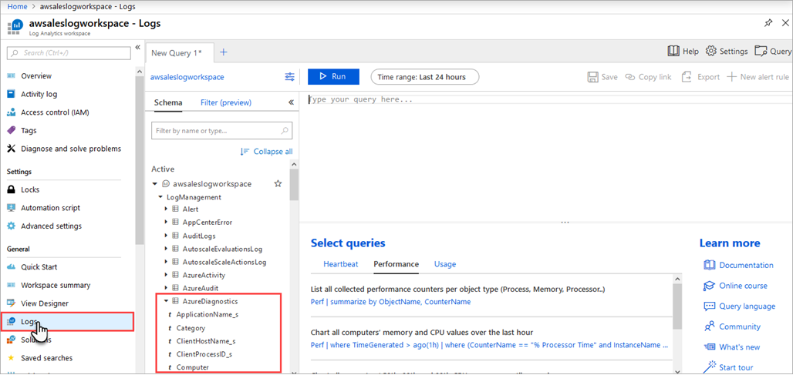

# Monitor Azure Analysis Services

[!INCLUDE [horz-monitor-intro](~/../reusable-content/ce-skilling/azure/includes/azure-monitor/horizontals/horz-monitor-intro.md)]

Analysis Services also provides several non-Azure Monitor monitoring mechanisms:

- SQL Server Profiler, installed with SQL Server Management Studio (SSMS), captures data about engine process events such as the start of a batch or a transaction, enabling you to monitor server and database activity. For more information, see [Monitor Analysis Services with SQL Server Profiler](/analysis-services/instances/use-sql-server-profiler-to-monitor-analysis-services).
- Extended Events (xEvents) is a light-weight tracing and performance monitoring system that uses few system resources, making it an ideal tool for diagnosing problems on both production and test servers. For more information, see [Monitor Analysis Services with SQL Server Extended Events](/analysis-services/instances/monitor-analysis-services-with-sql-server-extended-events).
- Dynamic Management Views (DMVs) use SQL syntax to interface schema rowsets that return metadata and monitoring information about server instances. For more information, see [Use Dynamic Management Views (DMVs) to monitor Analysis Services](/analysis-services/instances/use-dynamic-management-views-dmvs-to-monitor-analysis-services).

[!INCLUDE [horz-monitor-resource-types](~/../reusable-content/ce-skilling/azure/includes/azure-monitor/horizontals/horz-monitor-resource-types.md)]
For more information about the resource types for Analysis Services, see [Analysis Services monitoring data reference](monitor-analysis-services-reference.md).

[!INCLUDE [horz-monitor-data-storage](~/../reusable-content/ce-skilling/azure/includes/azure-monitor/horizontals/horz-monitor-data-storage.md)]

<a name="server-metrics"></a>
[!INCLUDE [horz-monitor-platform-metrics](~/../reusable-content/ce-skilling/azure/includes/azure-monitor/horizontals/horz-monitor-platform-metrics.md)]
For a list of available metrics for Analysis Services, see [Analysis Services monitoring data reference](/azure/monitor-analysis-services-reference#metrics).

[!INCLUDE [horz-monitor-resource-logs](/azure/reusable-content/ce-skilling/azure/includes/azure-monitor/horizontals/horz-monitor-resource-logs)]
- For the available resource log categories, associated Log Analytics tables, and the logs schemas for Analysis Services, see [Analysis Services monitoring data reference](/azure/monitor-analysis-services-reference#resource-logs).

## Analysis Services resource logs

To learn how to set up diagnostics logging, see [Set up diagnostic logging](analysis-services-logging.md).

When you set up logging for Analysis Services, you can select **Engine** or **Service** events to log, or select **AllMetrics** to log metrics data. For more information, see [Supported resource logs for Microsoft.AnalysisServices/servers](monitor-analysis-services-reference.md#supported-resource-logs-for-microsoftanalysisservicesservers).

[!INCLUDE [horz-monitor-activity-log](/azure/reusable-content/ce-skilling/azure/includes/azure-monitor/horizontals/horz-monitor-activity-log)]

[!INCLUDE [horz-monitor-analyze-data](/azure/reusable-content/ce-skilling/azure/includes/azure-monitor/horizontals/horz-monitor-analyze-data)]

[!INCLUDE [horz-monitor-external-tools](/azure/reusable-content/ce-skilling/azure/includes/azure-monitor/horizontals/horz-monitor-external-tools)]

### Analyze Analysis Services metrics

You can use Analysis Services metrics in Azure Monitor Metrics Explorer to help you monitor the performance and health of your servers. For example, you can monitor memory and CPU usage, number of client connections, and query resource consumption.

To determine if scale-out for your server is necessary, monitor your server **QPU** and **Query pool job queue length** metrics. A good metric to watch is average QPU by ServerResourceType, which compares average QPU for the primary server with the query pool. For detailed instructions on how to scale out your server based on metrics data, see [Azure Analysis Services scale-out](analysis-services-scale-out.md).


For a complete listing of metrics collected for Analysis Services, see [Analysis Services monitoring data reference](/azure/monitor-analysis-services-reference#metrics).

### Analyze logs in Log Analytics workspace

Metrics and server events are integrated with xEvents in your Log Analytics workspace resource for side-by-side analysis. Log Analytics workspace can also be configured to receive events from other Azure services, providing a holistic view of diagnostic logging data across your architecture.

To view your diagnostic data, in Log Analytics workspace, open **Logs**  from the left menu.



In the query builder, expand **LogManagement** > **AzureDiagnostics**. AzureDiagnostics includes **Engine** and **Service** events. Notice a query is created on the fly. The **EventClass\_s** field contains xEvent names, which might look familiar if you use xEvents for on-premises logging. Select **EventClass\_s** or one of the event names, and Log Analytics workspace continues constructing a query. Be sure to save your queries to reuse later.

<a name="example-queries"></a>
[!INCLUDE [horz-monitor-kusto-queries](/azure/reusable-content/ce-skilling/azure/includes/azure-monitor/horizontals/horz-monitor-kusto-queries)]

The following queries are useful for monitoring your Analysis Services server.

#### Example 1

The following query returns durations for each query end/refresh end event for a model database and server. If scaled out, the results are broken out by replica because the replica number is included in ServerName_s. Grouping by RootActivityId_g reduces the row count retrieved from the Azure Diagnostics REST API and helps stay within the limits as described in Log Analytics Rate limits.

```Kusto
let window = AzureDiagnostics
   | where ResourceProvider == "MICROSOFT.ANALYSISSERVICES" and Resource =~ "MyServerName" and DatabaseName_s =~ "MyDatabaseName" ;
window
| where OperationName has "QueryEnd" or (OperationName has "CommandEnd" and EventSubclass_s == 38)
| where extract(@"([^,]*)", 1,Duration_s, typeof(long)) > 0
| extend DurationMs=extract(@"([^,]*)", 1,Duration_s, typeof(long))
| project  StartTime_t,EndTime_t,ServerName_s,OperationName,RootActivityId_g,TextData_s,DatabaseName_s,ApplicationName_s,Duration_s,EffectiveUsername_s,User_s,EventSubclass_s,DurationMs
| order by StartTime_t asc
```

#### Example 2

The following query returns memory and QPU consumption for a server. If scaled out, the results are broken out by replica because the replica number is included in ServerName_s.

```Kusto
let window = AzureDiagnostics
   | where ResourceProvider == "MICROSOFT.ANALYSISSERVICES" and Resource =~ "MyServerName";
window
| where OperationName == "LogMetric" 
| where name_s == "memory_metric" or name_s == "qpu_metric"
| project ServerName_s, TimeGenerated, name_s, value_s
| summarize avg(todecimal(value_s)) by ServerName_s, name_s, bin(TimeGenerated, 1m)
| order by TimeGenerated asc 
```

#### Example 3

The following query returns the Rows read/sec Analysis Services engine performance counters for a server.

```Kusto
let window =  AzureDiagnostics
   | where ResourceProvider == "MICROSOFT.ANALYSISSERVICES" and Resource =~ "MyServerName";
window
| where OperationName == "LogMetric" 
| where parse_json(tostring(parse_json(perfobject_s).counters))[0].name == "Rows read/sec" 
| extend Value = tostring(parse_json(tostring(parse_json(perfobject_s).counters))[0].value) 
| project ServerName_s, TimeGenerated, Value
| summarize avg(todecimal(Value)) by ServerName_s, bin(TimeGenerated, 1m)
| order by TimeGenerated asc 
```

[!INCLUDE [horz-monitor-alerts](/azure/reusable-content/ce-skilling/azure/includes/azure-monitor/horizontals/horz-monitor-alerts)]

### Analysis Services alert rules
The following table lists some common and popular alert rules for Analysis Services.

| Alert type | Condition | Description  |
|:---|:---|:---|
|Metric | Whenever the maximum qpu_metric is greater than dynamic threshold. | If your QPU regularly maxes out, it means the number of queries against your models is exceeding the QPU limit for your plan.|
|Metric | Whenever the maximum QueryPoolJobQueueLength is greater than dynamic threshold. | The number of queries in the query thread pool queue exceeds available QPU.|

[!INCLUDE [horz-monitor-advisor-recommendations](/azure/reusable-content/ce-skilling/azure/includes/azure-monitor/horizontals/horz-monitor-advisor-recommendations)]

## Related content

- See [Analysis Services monitoring data reference](monitor-analysis-services-reference.md) for a reference of the metrics, logs, and other important values created for Analysis Services.
- See [Monitoring Azure resources with Azure Monitor](/azure/azure-monitor/essentials/monitor-azure-resource) for general details on monitoring Azure resources.
