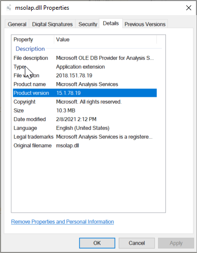
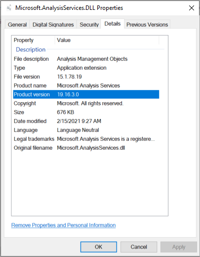
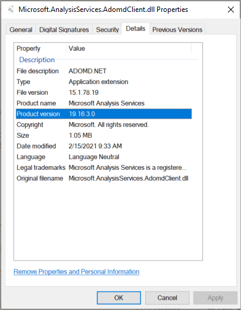

# Analysis Services client libraries

[!INCLUDE[appliesto-sqlas-all-aas-pbip](includes/appliesto-sqlas-all-aas-pbip.md)]

Client libraries are necessary for client applications and tools to connect to Analysis Services. Microsoft client applications like Power BI Desktop, Excel, SQL Server Management Studio (SSMS), and Analysis Services projects extension for Visual Studio install all three client libraries and update them along with regular application updates. Custom client applications also require client libraries are installed. Client libraries are updated monthly. 

**Important:** Before getting the latest versions, be sure to see [Known issues](#known-issues).

## Download the latest

### Windows Installer  

|Download  | Version  |
|---------|---------|
|[MSOLAP (amd64)](https://go.microsoft.com/fwlink/?linkid=829576)    |    16.0.130.20        |
|[MSOLAP (x86)](https://go.microsoft.com/fwlink/?linkid=829575)     |     16.0.130.20           |
|[AMO](https://go.microsoft.com/fwlink/?linkid=829578)     |   19.79.0.0         |
|[ADOMD](https://go.microsoft.com/fwlink/?linkid=829577)     |    19.79.0.0           |

### NuGet packages

Analysis Services Management Objects (AMO/TOM) and ADOMD client libraries are available as installable packages from [NuGet.org](https://www.nuget.org/). It's recommended you migrate to NuGet references instead of using Windows Installer.

Starting Feb. 2021, versions of [.NET Core](/dotnet/core/about) packages equivalent to the AMO and ADOMD client packages are also available. There are, however, a few scenarios not-supported by the .NET Core versions. To learn more, see [Known issues](#known-issues) later in this article.

NuGet package assemblies AssemblyVersion follow semantic versioning: MAJOR.MINOR.PATCH. NuGet references load the expected version even if there's a different version in the GAC (resulting from MSI install). PATCH is incremented for each release. AMO and ADOMD versions are kept in-sync.

#### AMO and ADOMD

|Package  | Version  |
|---------|---------|
|[AMO](https://www.nuget.org/packages/Microsoft.AnalysisServices.retail.amd64/)    |    19.79.0     |
|[ADOMD](https://www.nuget.org/packages/Microsoft.AnalysisServices.AdomdClient.retail.amd64/)     |   19.79.0     |

#### AMO and ADOMD .Net Core

|Package  | Version  |
|---------|---------|
|[AMO .Net Core](https://www.nuget.org/packages/Microsoft.AnalysisServices.NetCore.retail.amd64)    |    19.79.0      |
|[ADOMD .Net Core](https://www.nuget.org/packages/Microsoft.AnalysisServices.AdomdClient.NetCore.retail.amd64)     |   19.79.0        |

Beginning with AMO (AMO/TOM) and ADOMD .Net Core version 19.48.0.0, HTTP-based communications with cloud services like Power BI and Azure Analysis Services are significantly improved. It's recommended you update to the latest version to take advantage of these performance improvements. 

#### TMDL Preview

Beginning with AMO release 19.72.0, TMDL functionality is now included in Microsoft.AnalysisServices.Tabular.dll. If you've been using the [Microsoft.AnalysisServices.Tabular.Tmdl](https://www.nuget.org/packages/Microsoft.AnalysisServices.Tabular.Tmdl.retail.amd64/19.69.6.2-TmdlPreview) NuGet package, be sure to **remove it from your project and recompile**. 

The following changes were made to the TMDL API that could impact your code:

- TmdlFormatException property name changes. For example, **Path** changed to **Document**.

To learn more about TMDL, see [Tabular Model Definition Language overview](tmdl/tmdl-overview.md).

## Minimum required versions

Transport Layer Security (TLS) protocol version 1.0/1.1 was [deprecated](/azure/active-directory/fundamentals/whats-new#november-2020) in Microsoft Entra ID on June 30, 2021. TLS 1.2 or higher is now required. TLS 1.2 isn't supported in earlier versions of the Analysis Services client libraries. Newer client library versions include support for TLS 1.2 and higher in addition to other important security enhancements.

To minimize risk and potential security vulnerabilities, beginning June 30, 2021, enhanced security in Azure Analysis Services and Power BI require the following or higher versions:

|Client lib  |File version  | Version  |
|---------|---------|---------|
|MSOLAP     |   2018.151.61.21       |    15.1.61.21       |
|AMO     |   15.1.61.21        |    19.12.3.0      |
|ADOMD     |   15.1.61.21        |    19.12.3.0      |

## Known issues

#### AMO and ADOMD

Beginning with version 19.67.0, connectivity objects like Microsoft.AnalysisServices.AdomdClient.AdomdConnection and Microsoft.AnalysisServices.Server, support a new **AccessToken** property that enables an improved way to pass external OAuth tokens to be used by the XMLA connectivity layer. To learn more, see [Connection string properties - User ID=...; Password=](../analysis-services/instances/connection-string-properties-analysis-services.md#user-idpassword).

Beginning with version 19.42.0.4, ADOMD.NET and AMO/TOM use MSAL ([Microsoft.Identity.Client](https://www.nuget.org/packages/Microsoft.Identity.Client/)) version 4.43.0 or higher instead of ADAL to authenticate users with Microsoft Entra ID when establishing a connection to cloud-based services like Power-BI and Azure Analysis Services. If your application or another component the application depends on is using MSAL, it may be necessary to update the application's binding redirect settings if there are conflicts between the versions of MSAL loaded by the components.

#### AMO and ADOMD .Net Core 

Supported scenarios include connections to Azure Analysis Services, Power BI Premium, and SQL Server Analysis Services. TCP based connectivity is supported for Windows computers only.

Interactive login with Microsoft Entra ID is supported for Windows computers only. The .NET Core Desktop runtime is required.

Dependency in MSAL requires version 4.43.0 or higher.

Version 19.14.0 of the .Net Core client libraries introduced preview support for Self-Contained publishing (both in a published directory, and in single-file mode), in addition to support for consumption by .NET 5.0 projects. Several issues related to connectivity to SQL Server Analysis Services that were identified in the previous release have been fixed.

Version 19.12.7.2 of the .Net Core client libraries introduced support for SQL Server Analysis Services. Lower preview versions only supported Azure Analysis Services and Power BI semantic models.

#### AMO

Version 19.12.3.0 of the AMO client library introduces a new enumeration, **Microsoft.AnalysisServices.DataType**. However, the previous enumeration, **Microsoft.AnalysisServices.Tabular.DataType** still exists. If your code references the previous enumeration as **DataType** in a code file with statements to both namespaces (**Microsoft.AnalysisServices**, **Microsoft.AnalysisServices.Tabular**), due to the ambiguity, you could get an error when compiling. To resolve the error, fully qualify the reference to the enumeration.

Version 19.61.1.4 of the AMO client library introduces a change in transaction rollback behavior of **Microsoft.AnalysisServices.Server**. In earlier versions, a call to [**Server.RollbackTransaction()**](/dotnet/api/microsoft.analysisservices.server.rollbacktransaction) sends a request to the engine to roll back the transaction and then attempt to roll back local changes. Unlike earlier versions, in 19.61.1.4 and later, if local changes cannot be rolled back safely, tabular databases included in the transaction block any additional changes until they can be fully synced and the obsolete changes from the transaction that were rolled back are removed. An **InvalidOperationException** is raised when a change is made to the relevant tabular database. If your code is calling **Server.RollbackTransaction()**, it's recommended to follow that call with a full sync [**[Database.Refresh(true)]**](/dotnet/api/microsoft.analysisservices.majorobject.refresh) for any tabular database that is modified as part of the transaction.

Beginning with version 19.77.0, when cloning or copying a MetadataObject into another instance of a MetadataObject by using the Tabular Object Model (TOM), TOM returns null for properties that cross-reference objects outside of the MetadataObject’s direct tree of child objects. You must add the cloned MetadataObject instance to the semantic model so that cross references to objects outside of the MetadataObject tree can be resolved.

For example, when cloning a table with a partition that references a named expression in an EntityPartitionSource, the ExpressionSource property of the EntityPartitionSource returns null until the cloned table is added to the semantic model as in the code snippet below so that the cloned ExpressionSource reference can be resolved. The clone must be added to the model because the cross-referenced named expression is a member of the model’s Expressions collection and not part of the table’s tree of child objects. 
```
Table tableClone = model.Tables[0].Clone();
anotherModel.Tables.Add(tableClone);
```

#### ADOMD

Beginning with ADOMD (both .NET Framework, and .NET Core) version 19.61.1.4, compression is fully available in the XMLA transport layer. Previous releases after version 19.55.3.1 implemented some partial support for compression. Reports about issues with those releases were received. Those issues were fixed as part of the 16.61.1.4 release. Be sure to upgrade to 19.61.1.4 or later if you're experiencing problems related to compression.

#### MSOLAP

Beginning with version 16.0.43.20, MSOLAP uses MSAL ([Microsoft.Identity.Client](https://www.nuget.org/packages/Microsoft.Identity.Client/)) version 4.43.0 or higher instead of ADAL to authenticate users with Microsoft Entra ID when establishing a connection to cloud-based services like Power-BI and Azure Analysis Services. If your application or another component the application depends on is using MSAL, it may be necessary to update the application's binding redirect settings if there are conflicts between the versions of MSAL loaded by the components

A regression related to connections to cloud-based systems using Microsoft Entra ID was discovered in the 16.0.4.17 version of OLEDB (MSOLAP). It was fixed in the 16.0.20.201 version. Due to the nature of the issue, an installed 16.0.4.17 version, as well any other version prior to 16.0.20.201, cannot be corrected by supgrading the provider, even if setup is run in repair mode. It’s recommended to completely uninstall the 16.0.4.17 [or other problematic] version and then install the 16.0.20.201 or later version. 

In an earlier release, MSOLAP was updated to connect to cloud-based Analysis Services using the managed Microsoft Authentication Library (MSAL). Beginning with version 16.0.87.16, MSOLAP setup no longer installs the original native Azure Active Directory Authentication Library (ADAL) component.

## Understanding client libraries

Analysis Services utilizes three client libraries. ADOMD.NET and Analysis Services Management Objects (AMO) are managed client libraries. And Analysis Services OLE DB Provider (MSOLAP DLL) is a native client library. Typically, all three are installed at the same time.

Microsoft client applications like Power BI Desktop and Excel install all three client libraries and update them when new versions are available. Depending on the version or frequency of updates, some client libraries may not be the latest versions required by Azure Analysis Services and Power BI. The same applies to custom applications or other interfaces such as AsCmd, TOM, ADOMD.NET. These applications require manually or programmatically installing the libraries. The client libraries for manual installation are included in SQL Server feature packs as distributable packages. However, these client libraries are tied to the SQL Server version and may not be the latest. Make sure you always install the latest, downloadable from this article.  

### Client library types

#### Analysis Services OLE DB Provider (MSOLAP)

 Analysis Services OLE DB Provider (MSOLAP) is the native client library for Analysis Services database connections. It's used indirectly by both ADOMD.NET and AMO, delegating connection requests to the data provider. You can also call the OLE DB Provider directly from application code.  
  
 The Analysis Services OLE DB Provider is installed automatically by most tools and client applications used to access Analysis Services databases. It must be installed on computers used to access Analysis Services data.  
  
 OLE DB providers are often specified in connection strings. An Analysis Services connection string uses a different nomenclature to refer to the OLE DB Provider: MSOLAP.\<version>.dll.

#### AMO  

 AMO is a managed client library used for server administration and data definition. It's installed and used by tools and client applications. For example, SQL Server Management Studio (SSMS) uses AMO to connect to Analysis Services. A connection using AMO is typically minimal, consisting of `"data source=\<servername>"`. After a connection is established, you use the API to work with database collections and major objects. Both Visual Studio and SSMS use AMO to connect to an Analysis Services instance.  

#### ADOMD

 ADOMD.NET is a managed data client library used for querying Analysis Services data. It's installed and used by tools and client applications.
  
 When connecting to a database, the connection string properties for all three libraries are similar. Almost any connection string you define for ADOMD.NET by using  [Microsoft.AnalysisServices.AdomdClient.AdomdConnection.ConnectionString](/dotnet/api/microsoft.analysisservices.adomdclient.adomdconnection.connectionstring) also works for AMO and the Analysis Services OLE DB Provider (MSOLAP). To learn more, see [Connection string properties](instances/connection-string-properties-analysis-services.md).

## Check installed versions

### OLEDDB (MSOLAP)  

1. Go to `C:\Program Files\Microsoft Analysis Services\AS OLEDB\`. If you have more than one folder, choose the higher number.
1. Right-click **msolap.dll** > **Properties** > **Details**. Check the **Product version** property. Note: If the filename is msolap140.dll, it's older than latest version and should be upgraded.

    

### AMO

1. Go to `C:\Windows\Microsoft.NET\assembly\GAC_MSIL\Microsoft.AnalysisServices\`. If you have more than one folder, choose the higher number.
1. Right-click **Microsoft.AnalysisServices** > **Properties** > **Details**.  

    

### ADOMD

1. Go to `C:\Windows\Microsoft.NET\assembly\GAC_MSIL\Microsoft.AnalysisServices.AdomdClient\`. If you have more than one folder, choose the higher number.
1. Right-click **Microsoft.AnalysisServices.AdomdClient** > **Properties** > **Details**.  

    

## Manually update

Client libraries are typically installed and updated automatically along with tools and client applications that use them. However, in some cases client libraries may not be updated automatically and each must be manually updated. To update manually, download and run the Windows Installer (.msi) package for each client library.

### To download and update

1. Click:
    - [Download MSOLAP (amd64)](https://go.microsoft.com/fwlink/?linkid=829576) or [Download MSOLAP (x86)](https://go.microsoft.com/fwlink/?linkid=829575)
    - [Download AMO](https://go.microsoft.com/fwlink/?linkid=829578)
    - [Download ADOMD](https://go.microsoft.com/fwlink/?linkid=829577)

1. In **Downloads**, click a Windows Installer Package to run Setup.
1. In Setup, click **Next**.
1. Read the license agreement. If you agree, select **I accept the terms in the license agreement**, and then click **Next**.
1. Click, **Install**.
1. When completed, click **Finish**.
