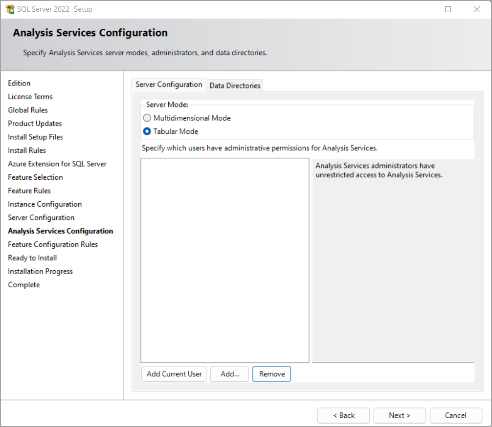

# Install SQL Server Analysis Services

[!INCLUDE[appliesto-sqlas](../../includes/appliesto-sqlas.md)]
  
SQL Server Analysis Services is installed by using the SQL Server Installation Wizard \(setup.exe). This article describes only those Wizard pages or command line settings necessary for installing and specifying initial configuration settings when installing an Analysis Services instance by using the Wizard.

If you've never installed SQL Server or SQL Server Analysis Services before, it's important you have a good understanding of the Wizard. For more detailed step-by-step information about using the wizard, see [Install SQL Server from the Installation Wizard (Setup)](/sql/database-engine/install-windows/install-sql-server-from-the-installation-wizard-setup). For more detailed information about Wizard configuration pages, see [Installation Wizard help](/sql/sql-server/install/instance-configuration)

SQL Server Analysis Services is multi-instance, meaning you can install more than one copy on a single computer, or run new and old versions side-by-side. An instance runs in either Tabular mode (default) or Multidimensional mode. If you want to run more than one mode, you'll need a separate instance for each one.  
  
After you install the server in a particular mode, you can use it host solutions that conform to that mode. For example, a tabular mode server is required if you want tabular model data access over the network.  

## Install using the wizard 

 The following shows which pages in the SQL Server Installation Wizard are used to install Analysis Services.  
  
1. On the **Feature Selection** page, select **Analysis Services** from the feature tree.  
  
       
  
2. On the **Analysis Services Configuration** page > **Server Configuration** tab, select a mode. Then add users that will have Administrator permissions for the instance. Click the **Data Directories** tab verify default or specify different [data directories](/sql/sql-server/install/instance-configuration#analysis-services-configuration---data-directories-page).
  
       
  
  Tabular mode uses the VertiPaq in-memory analytics engine (VertiPaq), which is the default storage for tabular models. After you deploy tabular models to the server, you can selectively configure tabular solutions to use DirectQuery disk storage as an alternative to memory-bound storage.  

Multidimensional mode uses MOLAP as the default storage for models deployed to Analysis Services. After deploying to the server, you can configure a solution to use ROLAP if you want to run queries directly against the relational database rather than storing query data in an Analysis Services  multidimensional database .  

Memory management and IO settings can be adjusted to get better performance when using non-default storage modes. See [Server properties in Analysis Services](../../../analysis-services/server-properties/server-properties-in-analysis-services.md) for more information.  
  
## Command Line Setup

 SQL Server Setup includes a parameter (**ASSERVERMODE**) that specifies the server mode. The following example illustrates a command line setup that installs Analysis Services in Tabular server mode.  
  
```
Setup.exe /q /IAcceptSQLServerLicenseTerms /ACTION=install /FEATURES=AS /ASSERVERMODE=TABULAR /INSTANCENAME=ASTabular /INDICATEPROGRESS /ASSVCACCOUNT=<DomainName\UserName> /ASSVCPASSWORD=<StrongPassword> /ASSYSADMINACCOUNTS=<DomainName\UserName>   
```  
  
 **INSTANCENAME** must be less than 17 characters.  
  
 All placeholder account values must be replaced with valid accounts and password.  
  
 **ASSERVERMODE** is case-sensitive.  All values must be expressed in upper case. The following table describes the valid values for **ASSERVERMODE**.  
  
|Value|Description|  
|-----------|-----------------|  
|TABULAR|This is the default value. If you do not set **ASSERVERMODE**, the server is installed in Tabular mode.|
|MULTIDIMENSIONAL|This value is optional.|  
  
## Get tools and designers

 The Wizard no longer installs SQL Server Data Tools \(SSDT) used for designing models or SQL Server Management Studio \(SSMS) used for server administration. Designers and tools now have a separate installation. To learn about and install both Microsoft and third party tools, see [Analysis Services tools](../../tools-and-applications-used-in-analysis-services.md).
  
 You'll need both Visual Studio with the Analysis Services projects extension and SSMS to create, deploy, and work with Analysis Services instances and databases. Tools can be installed anywhere, but be sure to configure ports on the server before attempting a connection. See [Configure the Windows Firewall to Allow Analysis Services Access](../../../analysis-services/instances/configure-the-windows-firewall-to-allow-analysis-services-access.md) for details.  

## See also

[SQL Server Installation Wizard](/sql/database-engine/install-windows/installation-for-sql-server)  
[Determine the Server Mode of an Analysis Services Instance](../../../analysis-services/instances/determine-the-server-mode-of-an-analysis-services-instance.md)  
[Comparing tabular and multidimensional solutions](../../comparing-tabular-and-multidimensional-solutions-ssas.md)
