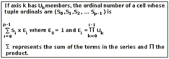

# Updating Cells (XMLA)
  You can use the [UpdateCells](../xmla/xml-elements-commands/updatecells-element-xmla.md) command to change the value of one or more cells in a cube enabled for cube writeback. [!INCLUDE[msCoName](../includes/msconame-md.md)] [!INCLUDE[ssNoVersion](../includes/ssnoversion-md.md)] [!INCLUDE[ssASnoversion](../includes/ssasnoversion-md.md)] stores the updated information in a separate writeback table for each partition that contains cells to be updated.  
  
> [!NOTE]  
>  The **UpdateCells** command does not support allocations during cube writeback. To use allocated writeback, you should use the [Statement](../xmla/xml-elements-commands/statement-element-xmla.md) command to send a Multidimensional Expressions (MDX) UPDATE statement. For more information, see [UPDATE CUBE Statement &#40;MDX&#41;](/sql/mdx/mdx-data-manipulation-update-cube).  
  
## Specifying Cells  
 The [Cell](../xmla/xml-elements-properties/cell-element-xmla.md) property of the **UpdateCells** command contains the cells to be updated. You identify each cell in the **Cell** property using that cell's ordinal number. Conceptually, [!INCLUDE[ssASnoversion](../includes/ssasnoversion-md.md)] numbers cells in a cube as if the cube were a *p*-dimensional array, where *p* is the number of axes. Cells are addressed in row-major order. The following illustration shows the formula for calculating the ordinal number of a cell.  
  
   
  
 Once you know a cell's ordinal number, you can indicate the intended value of the cell in the [Value](../xmla/xml-elements-properties/value-element-xmla.md) property of the [Cell](../xmla/xml-elements-properties/cell-element-xmla.md) property.  
  
## See Also  
 [Update Element &#40;XMLA&#41;](../xmla/xml-elements-commands/update-element-xmla.md)   
 [Developing with XMLA in Analysis Services](../../analysis-services/multidimensional-models-scripting-language-assl-xmla/developing-with-xmla-in-analysis-services.md)  
  
