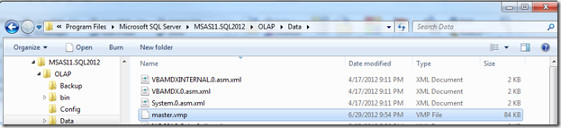
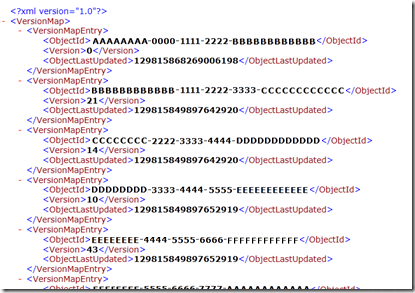
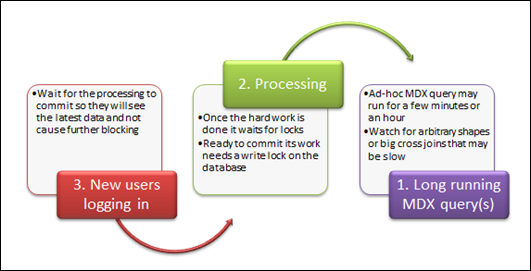
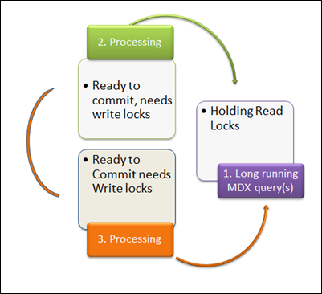

# Analysis Services stops accepting new connections

> [!NOTE]
> This article is derived from an MSDN blog originally posted on July 3, 2012.

When you process an Analysis Services object, such as FullProcess on a database or cube, old files need to be replaced with new files near the end of the processing phase. In addition, a lock is needed for the highest level in the database. The users who run queries have the priority until the queries are finished.

Sometimes, the users and the server administrator can't even sign in with SQL Server Management Studio to run a new query.

An Analysis Services database is a collection of files (some XML files that point to files, and some compressed binary files) that represent the objects in the cube that you query with MDX queries. Processing is the act of refreshing those objects by using a new set of data values from the relational database. It runs large relational database Transact-SQL queries to query from the data sources, do joins, aggregate the data, and save the compressed and aggregated data into the cube. The old copy of the Analysis Services database objects stays until the very end of the processing. When the processing is almost finished, the commit phase begins.

The commit phase needs an exclusive write lock. Users can’t query the objects at the moment when it swaps the old version of the cube data for the new version.

Another problem is that the instance-wide Master.vmp lock is required to finish the commit from processing. This special file is a pointer to all the other database objects and their current versions. This file is important when you swap out the old database objects with the new database objects.

As the server enters phase 2 of the commit, it tries to obtain a server-level lock to update Master.vmp. If another transaction is in process at that point, the server waits for an interval that's equal to the **ForceCommitTimeout** setting. The default is 30 seconds. Then, it rolls back any uncommitted transactions and aborts executing queries. The server-wide lock remains in effect until the transaction is finished. It blocks any read lock request that's initiated. When a new sign-in or existing user tries to connect to the server, they start a read lock request and wait.

This small file is the central point of the list of databases in Analysis Services. Never tamper with it or else your database is likely to be deleted.



The inside of the master.vmp (shown with XML formatting for clarity) shows each object (represented by a GUID value) and the version number (an integer 1, 2, 3… 43, and so on). The version number gets incremented every time when the object is processed (or synchronized) and committed by the server, and the time is updated. This is the central point of all objects in an Analysis Services instance.



## Why can’t you sign in when locking happens?

Locking can be the center of the problem. Here's a visual simplification of the blocking chain that prevents new users from getting into the database and running any query.



You might encounter this locking pattern. Slow queries aggravate the processing commit waits, and the server becomes unresponsive.
The head queries in Set 1 are taking many hours. The Set 2 locks are waiting for more than one hour.

- Set 1: Queries running holds database read locks (running for several hours)
- Set 2: Processing commit needs commit write locks (waiting about 1 hour or more)
- Set 3: New connections wait in line, blocked to read the soon-to-be-committed database

Sometimes the administrator can't even sign in with Management Studio because the connection gets queued in Set 3.

When most new connections come in from Management Studio, the server does their initialization to see database names and object names with discover commands. They might get stuck in line and wait to read the soon-to-be-committed and -processed database behind the processing Set 2.

The new connections will likely do a discovery command as follows:

`Discover on DBSCHEMA_CATALOGS`

`Discover on MDSCHEMA_MEMBERS`

During the commit phase of the processing transaction, queries can still be sent to the object, but they will be queued until the commit is completed. For more information about locking and unlocking during processing, see [Processing Analysis Services objects](https://docs.microsoft.com/previous-versions/sql/sql-server-2008/ms174860(v=sql.100)).

## Fix the problem

### Step 1: Minimize the MDX query duration

Tune the queries. Reduce the time that's required for Set 1 to finish. Then, you have the least conflict between queries and processing. In one example, the slow query was requesting an arbitrary shape. Tune or avoid arbitrary shape queries in Set 1 to:

- Run faster.
- Change syntax to avoid arbitrary shapes.
- Configure a timeout in the application to kill long-running queries.

Add aggregations and partitions to reduce the amount of reading of data that's required.

Tune any calculations that might cause the formula engine a long time to work on.

Run a profiler trace to investigate the MDX query.

Sometimes you can't control the queries at all. In an ad-hoc environment, when Excel pivot table users and custom MDX are enabled, you have the occasional runaway MDX query that might take a long time.

### Step 2: Avoid processing at peak hours to avoid query and processing collisions

In one example, the Set 2 full processing happens at 11:30 AM and noon. There's bound to be a locking collision during those busy times because there are significant queries running in the business then. Avoid processing at peak times.

### Step 3: Tell the server to favor one or the other when blocking occurs

Try these two configuration settings to enable the server to try killing either the long queries of Set 1 or the waiting processing of Set 2.

- **Kill the queries:** Set 2 can influence the server to cancel Set 1 after a time of waiting on locks with this setting.

  - **ForceCommitTimeout**: This server property is used to control what happens when a processing operation is waiting to finish its operation to enter the commit phase. When this value is greater than zero, SQL Server Analysis Services starts canceling prior transactions, but only after the specified value in milliseconds. If read locks become available before the **ForceCommitTimeout** period is reached, canceling won't occur.
- **Kill the processing:** Set 1 can influence the server to cancel Set 2 after waiting on locks occurs.

  - **CommitTimeout**: Analysis Server processing operations need to acquire a write lock before it can commit a transaction. To acquire a write lock, no other read locks can be taken by another process or query. Analysis Services must wait until all read locks are released. The transaction waits for a while to acquire a write lock, as specified by the **CommitTimeout** property, before rolling back.

Sometimes the cancellation doesn’t occur immediately, so even with **ForceCommitTimeout** and **CommitTimeout**, there can be a period where work is stalled.

## Another variation: Multiple processing requests can block each other

If you run two or more processing batches at the same time in different transactions, a similar locking chain and deadlock might occur. The following example is simplified. Assume there are two processing transactions that are ready near the same time, but they get blocked waiting on a user’s long MDX query.



The locking granularity at the end of processing is coarse at the database level and at the master.vmp file, so it's difficult to get parallel processing to go through successfully.

Processing start time isn't as important as the end time, so aim to avoid overlap at the end of processing jobs. If the two processing transactions are ready to commit around the same time, they might hold some locks and request other locks that cause a deadlock.

Adding a long-running MDX query into the mix makes it more likely to cause a deadlock chain because the intermediate locks can cause a circle to occur.

You might receive this error as a Notification event in the profiler trace:

```/
Transaction errors: Aborting transaction on session <victimsessionid>
```

The victim processing job will likely be canceled with this error:

```/
Transaction errors: While attempting to acquire one or more locks, the transaction was canceled.
```

## Proposed remedies for locking conflict between processing jobs

1. Schedule processing in a staggered manner. Remember that the end time is more important than the start time because the commit phase is the time where the high-granularity commit locks is needed.
2. Combine processing into a single transaction/batch XMLA tag.
If you process objects in the scope of a single transaction, maybe they won’t collide and kill each other. You can process parallel objects in a single transaction instead of in a sequence of small commits. You could have a larger, more granular commit to reduce the window in which locks occur, but you're increasing the surface area of the number of locks at lower-level granularity. This might increase conflict with user queries.
For example, you can have multiple processing commands in a single batch.

   ```xml
      <Batch xmlns="http://schemas.microsoft.com/analysisservices/2003/engine">
        <Parallel>
          <Process xmlns:xsd="http://www.w3.org/2001/XMLSchema"    xmlns:xsi="http://www.w3.org/2001/XMLSchema-instance"    xmlns:ddl2="http://schemas.microsoft.com/analysisservices/2003/engine/2"    xmlns:ddl2_2="http://schemas.microsoft.com/analysisservices/2003/engine/2/2"    xmlns:ddl100_100="http://schemas.microsoft.com/analysisservices/2008/engine/100/100"    xmlns:ddl200="http://schemas.microsoft.com/analysisservices/2010/engine/200"    xmlns:ddl200_200="http://schemas.microsoft.com/analysisservices/2010/engine/200/200"    xmlns:ddl300="http://schemas.microsoft.com/analysisservices/2011/engine/300"    xmlns:ddl300_300="http://schemas.microsoft.com/analysisservices/2011/engine/300/300">
      <Object>
   ```

   ```xml
        <DatabaseID>AdventureWorksDW2012</DatabaseID>
        <DimensionID>Dim Account</DimensionID>
      </Object>
      <Type>ProcessUpdate</Type>
      <WriteBackTableCreation>UseExisting</WriteBackTableCreation>
    </Process>
    <Process xmlns:xsd="http://www.w3.org/2001/XMLSchema" xmlns:xsi="http://www.w3.org/2001/XMLSchema-instance"    xmlns:ddl2="http://schemas.microsoft.com/analysisservices/2003/engine/2"    xmlns:ddl2_2="http://schemas.microsoft.com/analysisservices/2003/engine/2/2"    xmlns:ddl100_100="http://schemas.microsoft.com/analysisservices/2008/engine/100/100"    xmlns:ddl200="http://schemas.microsoft.com/analysisservices/2010/engine/200"    xmlns:ddl200_200="http://schemas.microsoft.com/analysisservices/2010/engine/200/200"    xmlns:ddl300="http://schemas.microsoft.com/analysisservices/2011/engine/300"    xmlns:ddl300_300="http://schemas.microsoft.com/analysisservices/2011/engine/300/300">
      <Object>
   ```

   ```xml
                <DatabaseID>AdventureWorksDW2012</DatabaseID>
                <DimensionID>Clustered Customers</DimensionID>
            </Object>
            <Type>ProcessFull</Type>
            <WriteBackTableCreation>UseExisting</WriteBackTableCreation>
        </Process>
     </Parallel>
   </Batch>
   ```

3. Process on one server and sync to another server to ensure these processes don't interfere with each other.

## How do you see these locks and blocking chains?

Starting with SQL Server 2008 R2 Service Pack 1, there are some great profiler trace events that help you see these locks. XML tags within the text of the trace events show who’s waiting and which locks are held. Collect a profiler trace with the ordinary events, but add these events to see who’s blocking whom and for how long, and on which objects the locks are conflicting.

The Lock Acquired event indicates when the transaction has obtained a batch of locks for the processing of the transaction. The Lock Released event indicates when the transaction has released a batch of locks that the transaction requested. This event also indicates the duration that the locks are held. The Lock Waiting event indicates when a transaction tries and waits in a queue to obtain a lock in a batch. This information is in the TextData column of those events. This information includes the following additional related data: 

- The transaction ID
- The LockList XML node
- The WaitList XML node
- The HoldList XML node

The Lock Acquired event and the Lock Released event contain the LockList information. The Lock Waiting event contains the LockList, WaitList, and HoldList information.

### LockList

The LockList node contains the following information:
 
- Lock type
- Lock status
- Object path of the object that's being requested
- Object ID

> [!NOTE]
> The object path is reported without a namespace. The Lock Released event additionally contains the **Duration** property. The **Duration** property indicates the duration that the lock is held in milliseconds.


The following is an example of the LockList node:

```xml
<LockList>
<Lock>
<Type>Read</Type>
<LockStatus>Acquired</LockStatus>
<Object><DatabaseID>AdventureWorks</DatabaseID></Object>
<ObjectID>asadfb-vfbvadr-ft3323-54235</ObjectID>
</Lock>
<Lock>
<Type>Read</Type>
<LockStatus>Waiting</LockStatus>
<Object><DatabaseID>FoodMart</DatabaseID><Object>
<ObjectID>asadfb-vfbvadr-ft3323-54235</ObjectID>
</Lock>
<Lock>
<Type>Read</Type>
<LockStatus>Requested</LockStatus>
<Object><DatabaseID>FoodMart</DatabaseID><Object>
<ObjectID>asadfb-vfbvadr-ft3323-54235</ObjectID>
</Lock>
</LockList>
```

In this example, the transaction requests three locks, obtains one, and waits for the second lock.

### WaitList

The WaitList node lists the waiting transactions that are ahead of the current transaction. The following is an example of the WaitList node: 

```xml
<WaitList>
     <Object><DatabaseID>FoodMart</DatabaseID><Object>
     <ObjectID>asadfb-vfbvadr-ft3323-54235</ObjectID>
     <Type>Read</Type>
     <Transaction>  
  <TransactionID>2342-3we-dsdf-sdf<TransactionID>
  <SPID>234</SPID>
  <Type>Write</Type>
     </Transaction>  
     <Transaction>  
  <TransactionID>2ger342-3rtee-dsdf-sdf<TransactionID>
  <SPID>222</SPID>
  <Type>Read</Type>
     </Transaction>  
</WaitList>
````

### HoldList

The HoldList node lists transactions that hold a lock that the current transaction tries to obtain. The following is an example of the HoldList node:

```xml
<HoldList>
     <Object><DatabaseID>FoodMart</DatabaseID><Object>
     <ObjectID>asadfb-vfbvadr-ft3323-54235</ObjectID>
     <Type>Read</Type>
     <Transaction>  
  <TransactionID>2342-3we-dsdf-sdf<TransactionID>
  <SPID>234</SPID>
  <Type>Write</Type>
     </Transaction>  
     <Transaction>  
  <TransactionID>2ger342-3rtee-dsdf-sdf<TransactionID>
  <SPID>222</SPID>
  <Type>Read</Type>
     </Transaction>  
</HoldList>
```

In SQL Server 2008 Analysis Services or later versions, you can run an MDX query on the dynamic management views to see the various connections, their transactions, and who’s granted locks and who’s waiting on locks (blocking).

```sql
select * from $system.discover_connections;
go
select * from $system.discover_sessions;
go
select * from $system.discover_transactions; 
go
select * from $system.discover_locks;
go
select * from $system.discover_jobs
go
```

## More information

- [SQL Server best practices](https://docs.microsoft.com/previous-versions/sql/sql-server-2005/administrator/cc966525(v=technet.10))
- [SQL Server 2008 white paper: Analysis Services Performance Guide](https://www.microsoft.com/download/details.aspx?id=17303)