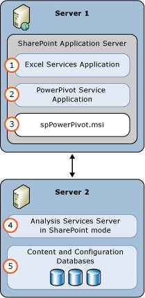

# Power Pivot for SharePoint

[!INCLUDE[appliesto-sql2019-earlier](includes/appliesto-sql2019-earlier.md)]
  
> [!IMPORTANT]
> Power Pivot mode is [Discontinued](what-s-new-in-sql-server-analysis-services.md?view=sql-analysis-services-2022&preserve-view=true#discontinued-features-in-ssas-2022) in SQL Server 2022 Analysis Services. Power Pivot mode in SQL Server 2019, 2017, 2016 Analysis Services remains supported for SharePoint 2016 and SharePoint 2013. Microsoft's BI strategy has shifted away from Power Pivot in Excel integration with SharePoint. [Power BI](https://powerbi.com/) and [Power BI Report Server](https://powerbi.microsoft.com/report-server/) are now the recommended platforms to host Excel workbooks with Power Pivot models.

Analysis Services in Power Pivot mode provides server hosting of Power Pivot data in a SharePoint farm. Power Pivot data is an analytical data model users create with Power Pivot in Excel. Server hosting of workbooks requires SharePoint, Excel Services, and an installation of Power Pivot for SharePoint. Data is loaded on Power Pivot for SharePoint instances where it can be refreshed at scheduled intervals using the Power Pivot data refresh capability.

## Power Pivot for SharePoint 2019

Support for Power Pivot Gallery and Refresh was removed from SharePoint Server 2019, effectively ending Analysis Services Power Pivot for SharePoint support for SharePoint 2019 and later. To learn more, see [What's deprecated or removed from SharePoint Server 2019](
/sharepoint/what-s-new/what-s-deprecated-or-removed-from-sharepoint-server-2019#removed-features-in-sharepoint-server-2019). 

## Power Pivot for SharePoint 2016

SQL Server 2019, 2017, 2016 Analysis Services Power Pivot mode supports SharePoint 2016 and Office Online Server usage of Excel workbooks containing data models and Reporting Services Power View reports.
  
Excel, within Office Online Server includes data model functionality to enable interaction with a Power Pivot workbook in the browser. You do not need to deploy the Power Pivot for SharePoint 2016 add-in into the farm. You only need to install an Analysis Services server in Power Pivot mode and register the server with Office Online Server.  
  
Deploying the Power Pivot for SharePoint 2016 add-in enables additional functionality and features in your SharePoint farm. The additional features include Power Pivot Gallery and Schedule Data Refresh.  
  
   

## Power Pivot for SharePoint 2013

SQL Server 2019, 2017, 2016 Analysis Services Power Pivot mode supports Microsoft SharePoint 2013 Excel Services usage of Excel workbooks containing data models and Reporting Services Power View reports.
  
Excel Services in SharePoint 2013 includes data model functionality to enable interaction with a Power Pivot workbook in the browser. You do not need to deploy the Power Pivot for SharePoint 2013 add-in into the farm. You only need to install an Analysis Services server in SharePoint mode and register the server within the Excel Services **Data Model** settings.  
  
 Deploying the Power Pivot for SharePoint 2013 add-in enables additional functionality and features in your SharePoint farm. The additional features include Power Pivot Gallery, Schedule Data Refresh, and the Power Pivot Management Dashboard.  
  
 

## Installation and configuration

To learn more about installation and configuration, see [Install Analysis Services in Power Pivot Mode](instances/install-windows/install-analysis-services-in-power-pivot-mode.md). Additional Power Pivot for SharePoint documentation common to all versions going back to SharePoint 2010 is available in the [SQL Server 2014 Analysis Services documentation](/previous-versions/sql/2014/analysis-services/analysis-services?view=sql-server-2014&preserve-view=true).
