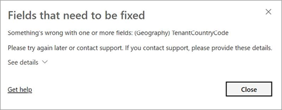

# Object-level security

[!INCLUDE[ssas-appliesto-sqlas-all-aas-pbip](../includes/ssas-appliesto-sqlas-all-aas-pbip.md)]

Data model security starts with effectively implementing [roles](../../analysis-services/tabular-models/roles-ssas-tabular.md) and row-level filters to define user permissions on data model objects and data. For tabular 1400 and higher models, you can also define object-level security (OLS), which includes table-level security and column-level security in the [Roles object](../tmsl/roles-object-tmsl.md). When configured, table and column data are secured, along with metadata to help prevent a malicious user from discovering that such an object exists.

OLS can be configured by using the open-source [Tabular Editor](https://tabulareditor.github.io/), [Tabular Model Scripting Language (TMSL)](../tmsl/tabular-model-scripting-language-tmsl-reference.md), or [Tabular Object Model (TOM)](../tom/introduction-to-the-tabular-object-model-tom-in-analysis-services-amo.md).

## Table-level security

With table-level security, you can not only restrict access to table data, but also sensitive table name metadata. Set the **metadataPermission** property of the **tablePermissions** class in the [Roles object](../tmsl/roles-object-tmsl.md) to **none**.

In this example, the metadataPermission property of the tablePermissions class for the Product table is set to none:

```
"roles": [
  {
    "name": "Users",
    "description": "All allowed users to query the model",
    "modelPermission": "read",
    "tablePermissions": [
      {
        "name": "Product",
        "metadataPermission": "none"
      }
    ]
  }
```

## Column-level security

Similar to table-level security, with column-level security you can not only restrict access to column data, but also sensitive column name metadata. Set the **metadataPermission** property of the **columnPermissions** class in the [Roles object](../tmsl/roles-object-tmsl.md) to **none**.

In this example, the metadataPermission property of the columnPermissions class for the Base Rate column in the Employees table is set to none:

```
"roles": [
  {
    "name": "Users",
    "description": "All allowed users to query the model",
    "modelPermission": "read",
    "tablePermissions": [
      {
        "name": "Employee",
        "columnPermissions": [
          {
            "name": "Base Rate",
            "metadataPermission": "none"
          }
        ]
      }
    ]
  }
```

## Restrictions

*  Table-level security cannot be set for a model if it breaks a relationship chain. An error is generated at design time.
 For example, if there are relationships between tables A and B, and B and C, you cannot secure table B. If table B is secured, a query on table A cannot transit the relationships between table A and B, and B and C. In this case, a separate relationship could be configured between tables A and C.

      

*  Row-level security and object-level security cannot be combined from different roles because it could introduce unintended access to secured data. An error is generated at query time for users who are members of such a combination of roles.

*  Dynamic calculations (measures, KPIs, DetailRows) are automatically  restricted if they reference a secured table or column. While there is no mechanism to explicitly secure a measure, it is possible to implicitly secure a measure by updating the expression to refer to a secured table or column.

*  Relationships that reference a secured column work provided the table the column is in is *not* secured.

## Power BI

Visualizations referencing a dataset object with OLS configured display the same message as for a deleted or non-existing object.

  

### Limitations

Datasets with OLS configured for one or more table or column objects are not supported with these Power BI features:

- Q&A visualizations
- Quick insights visualizations
- Smart narrative visualizations
- Excel Data Types gallery

## See also

[Roles](../../analysis-services/tabular-models/roles-ssas-tabular.md)  
[Roles object (TMSL)](../tmsl/roles-object-tmsl.md)  
[Tabular Model Scripting Language (TMSL)](../tmsl/tabular-model-scripting-language-tmsl-reference.md)  
[Tabular Object Model (TOM)](../tom/introduction-to-the-tabular-object-model-tom-in-analysis-services-amo.md).

