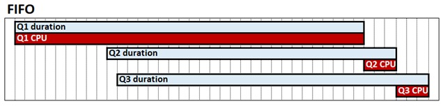
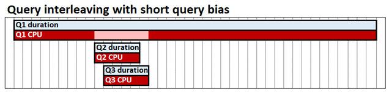

# Query interleaving

[!INCLUDE[appliesto-sqlas-all-aas-pbip](../includes/appliesto-sqlas-all-aas-pbip.md)]

Query interleaving is a tabular mode system configuration that can improve query performance in high-concurrency scenarios. By default, the Analysis Services tabular engine works in a first-in, first-out (FIFO) fashion with regards to CPU. With FIFO, for example, if one resource expensive and possibly slow storage-engine query is received, and then followed by two otherwise fast queries, the fast queries can potentially get blocked waiting for the expensive query to complete. This behavior is shown in the following diagram, which shows Q1, Q2 and Q3 as the respective queries, their duration, and CPU time.



Query interleaving with *short query bias* allows concurrent queries to share CPU resources, which means fast queries are not blocked behind slow queries. The time it takes to complete all three queries is still about the same, but in our example Q2 and Q3 are not blocked until the end. Short-query bias means fast queries, defined by how much CPU each query has already consumed at a given point in time can be allocated a higher proportion of resources than long-running queries. In the following diagram, Q2 and Q3 queries are deemed *fast* and allocated more CPU than Q1. 



Query interleaving is intended to have little or no performance impact on queries that run in isolation; a single query can still consume as much CPU as it does with the FIFO model. 

## Important considerations

Before determining if query interleaving is right for your scenario, keep the following in mind:

- Query interleaving applies only for import models. It does not affect DirectQuery models. 
- Query interleaving only considers CPU consumed by VertiPaq storage engine queries. It does not apply to formula engine operations. 
- A single DAX query can result in multiple VertiPaq storage engine queries. A DAX query is deemed *fast* or *slow* based on CPU consumed by its storage engine queries. The DAX query is the unit of measurement. 
- Refresh operations are by default protected from query interleaving. Long-running refresh operations are categorized differently to long-running queries. 

## Configure

To configure query interleaving, set the **Threadpool\SchedulingBehavior** property. This property can be specified with the following values:

|Value  |Description  |
|---------|---------|
|-1     |  Automatic. The engine will choose the queue type.        |
| 0  (default for SSAS 2019)   |  First in, first out (FIFO).       |
| 1     |  Short query bias. The engine gradually throttles long running queries when under pressure in favor of fast queries.       |
| 3 (default for Azure AS, Power BI, SSAS 2022 and later) | Short query bias with fast cancellation. Improves user query response times in high-concurrency scenarios. Applies to Azure AS, Power BI, SSAS 2022 and later only. |

At this time, the SchedulingBehavior property can be set only by using XMLA. In SQL Server Management Studio, the following XMLA snippet sets the **SchedulingBehavior** property to **1**, short query bias.

```xmla
<Alter AllowCreate="true" ObjectExpansion="ObjectProperties" xmlns="http://schemas.microsoft.com/analysisservices/2003/engine">
  <Object />
  <ObjectDefinition>
    <Server xmlns:xsd="http://www.w3.org/2001/XMLSchema" xmlns:xsi="http://www.w3.org/2001/XMLSchema-instance" xmlns:ddl2="http://schemas.microsoft.com/analysisservices/2003/engine/2" xmlns:ddl2_2="http://schemas.microsoft.com/analysisservices/2003/engine/2/2" xmlns:ddl100_100="http://schemas.microsoft.com/analysisservices/2008/engine/100/100" xmlns:ddl200="http://schemas.microsoft.com/analysisservices/2010/engine/200" xmlns:ddl200_200="http://schemas.microsoft.com/analysisservices/2010/engine/200/200" xmlns:ddl300="http://schemas.microsoft.com/analysisservices/2011/engine/300" xmlns:ddl300_300="http://schemas.microsoft.com/analysisservices/2011/engine/300/300" xmlns:ddl400="http://schemas.microsoft.com/analysisservices/2012/engine/400" xmlns:ddl400_400="http://schemas.microsoft.com/analysisservices/2012/engine/400/400" xmlns:ddl500="http://schemas.microsoft.com/analysisservices/2013/engine/500" xmlns:ddl500_500="http://schemas.microsoft.com/analysisservices/2013/engine/500/500">
      <ID>myserver</ID>
      <Name>myserver</Name>
      <ServerProperties>
        <ServerProperty>
          <Name>ThreadPool\SchedulingBehavior</Name>
          <Value>1</Value>
        </ServerProperty>
      </ServerProperties>
    </Server>
  </ObjectDefinition>
</Alter>
```

> [!IMPORTANT]
> A restart of the server instance is required. In Azure Analysis Services, you must pause and then resume the server, effectively restarting.

## Additional properties

In most cases, SchedulingBehavior is the only property you need to set. The following additional properties have defaults that should work in most scenarios with short query bias, however they can be changed if needed. The following properties *have no effect* unless query interleaving is enabled by setting the SchedulingBehavior property. 

**ReservedComputeForFastQueries** - Sets the number of reserved logical cores for *fast* queries. All queries are deemed *fast* until they decay because they have used up a certain amount of CPU. ReservedComputeForFastQueries is an integer between 0 and 100. The default value is 75. 

The unit of measure for ReservedComputeForFastQueries is the percentage of cores. For example, a value of 80 on a server with 20 cores attempts to reserve 16 cores for fast queries (while no refresh operations are being performed). ReservedComputeForFastQueries rounds up to the nearest whole number of cores. It's recommended you do not to set this property value below 50. This is because fast queries could be deprived and is counter to the overall design of the feature. 

**DecayIntervalCPUTime** - An integer representing the CPU time in milliseconds that a query spends before it decays. If the system is under CPU pressure, decayed queries are limited to the remaining cores not reserved for fast queries. The default value is 60,000. This represents 1 minute of CPU time, not elapsed calendar time. 

**ReservedComputeForProcessing** - Sets the number of reserved logical cores for each processing (data refresh) operation. The property value is an integer between 0 and 100, with a default value of 75 expressed. The value represents a percentage of the cores determined by the ReservedComputeForFastQueries property. A value of 0 (zero) means processing operations are subject to the same query interleaving logic as queries, so can be decayed. 

While no processing operations are being performed, ReservedComputeForProcessing has no effect. For example, with a value of 80, ReservedComputeForFastQueries on a server with 20 cores reserves 16 cores for fast queries. With a value of 75, ReservedComputeForProcessing will then reserve 12 of the 16 cores for refresh operations, leaving 4 for fast queries while processing operations are running and consuming CPU. As described in the **Decayed queries** section below, the remaining 4 cores (not reserved for fast queries or processing operations) will still be used for fast queries and processing if idle.

These additional properties are located under the **ResourceGovernance** properties node. In SQL Server Management Studio, the following example XMLA snippet sets the DecayIntervalCPUTime property to a value lower than default:

```xmla
<Alter AllowCreate="true" ObjectExpansion="ObjectProperties" xmlns="http://schemas.microsoft.com/analysisservices/2003/engine">
  <Object />
  <ObjectDefinition>
    <Server xmlns:xsd="http://www.w3.org/2001/XMLSchema" xmlns:xsi="http://www.w3.org/2001/XMLSchema-instance" xmlns:ddl2="http://schemas.microsoft.com/analysisservices/2003/engine/2" xmlns:ddl2_2="http://schemas.microsoft.com/analysisservices/2003/engine/2/2" xmlns:ddl100_100="http://schemas.microsoft.com/analysisservices/2008/engine/100/100" xmlns:ddl200="http://schemas.microsoft.com/analysisservices/2010/engine/200" xmlns:ddl200_200="http://schemas.microsoft.com/analysisservices/2010/engine/200/200" xmlns:ddl300="http://schemas.microsoft.com/analysisservices/2011/engine/300" xmlns:ddl300_300="http://schemas.microsoft.com/analysisservices/2011/engine/300/300" xmlns:ddl400="http://schemas.microsoft.com/analysisservices/2012/engine/400" xmlns:ddl400_400="http://schemas.microsoft.com/analysisservices/2012/engine/400/400" xmlns:ddl500="http://schemas.microsoft.com/analysisservices/2013/engine/500" xmlns:ddl500_500="http://schemas.microsoft.com/analysisservices/2013/engine/500/500">
      <ID>myserver</ID>
      <Name>myserver</Name>
      <ServerProperties>
        <ServerProperty>
          <Name>ResourceGovernance\DecayIntervalCPUTime</Name>
          <Value>15000</Value>
        </ServerProperty>
      </ServerProperties>
    </Server>
  </ObjectDefinition>
</Alter>
```

## Decayed queries

The constraints described in this section apply only if the system is under CPU pressure. For example, a single query, if it's the only one running in the system at a given time, can consume all the available cores regardless of whether it has decayed or not.  

Each query may require many storage-engine jobs. When a core in the pool for decayed queries becomes available, the scheduler will check the oldest running query based on elapsed calendar time to see if it has already used up its **Maximum Core Entitlement** (MCE). If no, its next job is executed. If yes, the next oldest query is evaluated. The query MCE is determined by how many decay intervals it has already used. For each decay interval used, the MCE is reduced based on the algorithm shown in the table below. This continues until either the query completes, times out, or the MCE is reduced to a single core. 

In the following example, the system has 32 cores, and the system's CPU is under pressure. 

ReservedComputeForFastQueries is 60 (60%). 

- 20 cores (19.2 rounded up) is reserved for fast queries. 
- The remaining 12 cores are allocated for decayed queries. 

DecayIntervalCPUTime is 60,000 (1 minute of CPU time).  

The lifecycle of a query may be as follows, as long as it doesn't timeout or complete: 

|Stage   |Status  |Execution/scheduling   |MCE   |
|---------|---------|---------|---------|
|0    |   Fast       |   The MCE is 20 cores (reserved for fast queries). <br> Query is executed in a FIFO fashion with respect to other *fast* queries across the 20 reserved cores. <br> Decay interval of 1 minute of CPU time is used up.       |     20 = <br> MIN(32/2˄0, 20)     |
|1     |  Decayed       |   The MCE is set to 12 cores (12 remaining cores not reserved for fast queries). <br> Jobs are executed based on availability up to MCE. <br> Decay interval of 1 minute of CPU time is used up.       |   12 = <br> MIN(32/2˄1, 12)       |
|2     |  Decayed       |    The MCE is set to 8 cores (quarter of 32 total cores). <br> Jobs are executed based on availability up to MCE. <br> Decay interval of 1 minute of CPU time is used up.      |    8 =  <br> MIN(32/2˄2, 12)      |
|3     |  Decayed        |   The MCE is set to 4 cores. <br> Jobs are executed based on availability up to MCE. <br> Decay interval of 1 minute of CPU time is used up.       |  4 = <br> MIN(32/2˄3, 12)        |
|4     |  Decayed        |   The MCE is set to 2 cores. <br> Jobs are executed based on availability up to MCE. <br> Decay interval of 1 minute of CPU time is used up.      |   2 = <br> MIN(32/2˄4, 12)       |         
|5     |  Decayed        |  The MCE is set to 1 core. <br> Jobs are executed based on availability up to MCE. <br> Decay interval does not apply as the query has bottomed. <br> No further decay since minimum of 1 core is reached.        |   1 = <br> MIN(32/2˄5, 12)       |

If the system is under CPU pressure, each query will be assigned no more cores than its MCE. If all the cores are currently used by queries within their respective MCEs, then other queries wait until cores become available. As cores become available, the oldest entitled query based on its elapsed calendar time is picked up. The MCE is a cap under pressure; it doesn't guarantee that number of cores at any point in time. 

## See also  

[Server properties in Analysis Services](../server-properties/server-properties-in-analysis-services.md)
