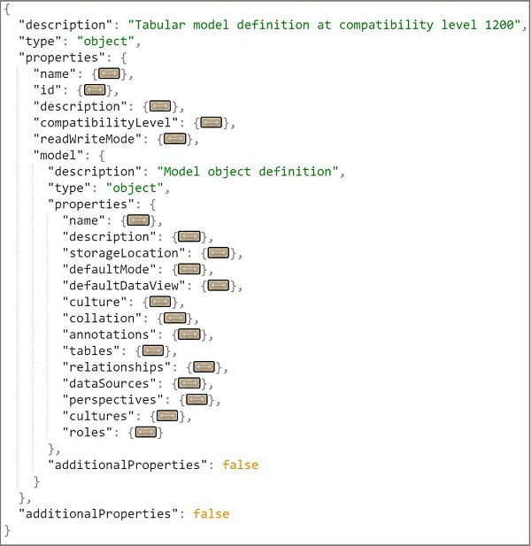

---
title: "Tabular Model Scripting Language (TMSL) Reference | Microsoft Docs"
description: Learn that Tabular Model Scripting Language (TMSL) is the command and object model definition syntax for tabular data models at compatibility level 1200 or higher.
ms.date: 08/04/2022
ms.service: analysis-services
ms.custom: tmsl
ms.topic: conceptual
ms.author: kfollis
ms.reviewer: kfollis
author: minewiskan

---
# Tabular Model Scripting Language (TMSL) Reference

[!INCLUDE[appliesto-sql2016-later-aas-pbip](../includes/appliesto-sql2016-later-aas-pbip.md)]

  Tabular Model Scripting Language (TMSL) is the command and object model definition syntax for tabular data models at compatibility level 1200 or higher. TMSL communicates with Analysis Services through the XMLA protocol, where the `XMLA.Execute` method accepts both JSON-based **statement** scripts in TMSL as well as the traditional XML-based scripts in Analysis Services Scripting Language (ASSL for XMLA).  
  
 Key elements of TMSL:  
  
- Tabular metadata based on tabular model semantics.

    A tabular model is composed of tables, columns, and relationships. Equivalent object definitions in TMSL are now, not surprisingly, tables, columns, relationships, and so forth. A new metadata engine supports these definitions.  
  
- Object definitions are  structured as JSON instead of XML.
  
     With the exception of how the payload is formatted (in either JSON or XML), both TMSL and ASSL are functionally equivalent in how they provide commands and metadata  to XMLA methods used for server communication and data transfer.  
  
## How to use TMSL

 The easiest way to  explore TMSL scripting is using the CREATE, ALTER, DELETE, or Process commands in SQL Server Management Studio (SSMS) on a model you already know.
  
1. Find the command you want to use: [TMSL Reference - Commands](tmsl-reference-commands.md)  
  
2. Check the object definition reference for objects used in the command: [TMSL Reference - Objects](tmsl-reference-tabular-objects.md)  
  
3. Choose a method for executing the TMSL script:  
  
    - XMLA window in SSMS  
  
    - [Invoke-ASCmd](/powershell/module/sqlserver/invoke-ascmd) PowerShell cmdlet 
  
    - [Analysis Services Execute DDL Task](/sql/integration-services/control-flow/analysis-services-execute-ddl-task) in SSIS.  
  
## Model definition schema

 The following screenshot shows an abbreviated version of the schema, collapsed to show the major objects.  
  
   
  
## Scripting languages in Analysis Services

 Analysis Services supports ASSL and TMSL scripting languages. Only tabular models created at the 1200 compatibility level or higher are described in TMS in JSON format.  
  
 Analysis Services Scripting Language (ASSL for XMLA) was the first scripting language, and is still the only scripting language for Multidimensional models and Tabular models at lower compatibility levels (1100 or 1103). In ASSL, tabular models at 110x are described in multidimensional terms, such as **cube** (for a model) and **measuregroup** (for a table).  
  
> [!NOTE]  
>  In [SQL Server Data Tools (SSDT), you can upgrade an earlier version tabular model to use TMSL by switching up its **CompatibilityLevel** to 1200 or higher. Remember that upgrade is irreversible. Prior to upgrading, back up your model in case you need the original version later.  
  
 The following table is the scripting language matrix for Analysis Services data models across different platforms/versions at specific compatibility levels.  

| Version | Multidimensional | Tabular 110x | Tabular 1200 | Tabular 1400 | Tabular 1500 |Tabular 1600|
| ------- | ---------------- | ------------ | ------------ | ------------ | ------------ | ------------ |
|Power BI Premium|NA|NA|NA|NA|TMSL|TMSL|
|Azure Analysis Services|NA|NA|TMSL|TMSL|TMSL|TMSL|
|SQL Server 2022 Analysis Services|ASSL|ASSL|TMSL|TMSL|TMSL|TMSL|
|SQL Server 2019 Analysis Services|ASSL|ASSL|TMSL|TMSL|TMSL|NA|
|SQL Server 2017 Analysis Services|ASSL|ASSL|TMSL|TMSL|NA|NA|
|SQL Server 2016 Analysis Services|ASSL|ASSL|TMSL|NA|NA|NA|
|SQL Server 2014 Analysis Services|ASSL|ASSL|NA|NA|NA|NA|
|SQL Server 2012 Analysis Services|ASSL|ASSL|NA|NA|NA|NA|
