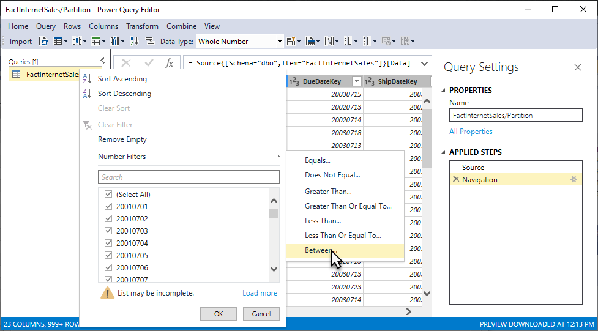
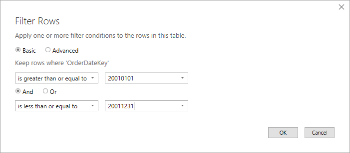
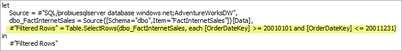
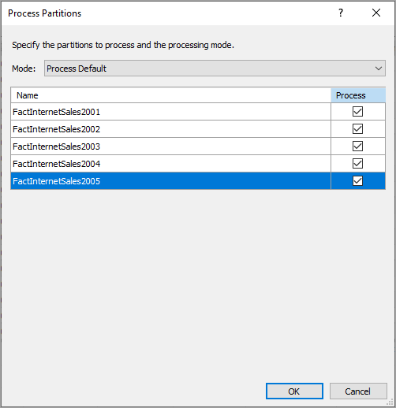
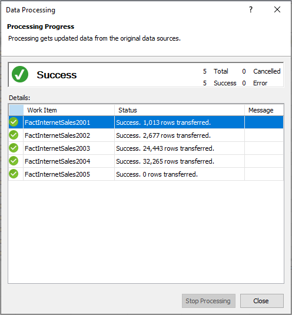

---
title: "Analysis Services tutorial lesson 10: Create partitions | Microsoft Docs"
description: Learn how to create partitions for an Analysis Services tabular model project.
ms.date: 02/20/2020
ms.service: analysis-services
ms.custom: tabular-models
ms.topic: tutorial
ms.author: owend
ms.reviewer: owend
author: minewiskan
---
# Create partitions

[!INCLUDE[appliesto-sql2019-later-aas-pbip](../includes/appliesto-sql2019-later-aas-pbip.md)]

In this lesson, you create partitions to divide the FactInternetSales table into smaller logical parts that can be processed (refreshed) independent of other partitions. By default, every table you include in your model has one partition, which includes all the table's columns and rows. For the FactInternetSales table, we want to divide the data by year; one partition for each of the table's five years. Each partition can then be processed independently. To learn more, see [Partitions](../tabular-models/partitions-ssas-tabular.md). 
  
Estimated time to complete this lesson: **15 minutes**  
  
## Prerequisites  

This article is part of a tabular modeling tutorial, which should be completed in order. Before performing the tasks in this lesson, you should have completed the previous lesson: [Lesson 9: Create Hierarchies](../tutorial-tabular-1400/as-lesson-9-create-hierarchies.md).  
  
## Create partitions  
  
#### To create partitions in the FactInternetSales table  
  
1.  In Tabular Model Explorer, expand **Tables**, and then right-click **FactInternetSales** > **Partitions**.  
  
2.  In Partition Manager, click **Copy**, and then change the name to **FactInternetSales2001**.
  
    Because you want the partition to include only those rows within a certain period, for the year 2001, you must modify the query expression. 
  
4.  Click **Design** to open Query Editor, and then click the **FactInternetSales2001** query.

5.  In preview, click the down arrow in the **OrderDateKey** column heading, and then click **Number Filters** > **Between**.

    

    You'll see the Data Type for OrderDateKey is Whole Number (integer). This is the most common way to express dates in a date key column in a data warehouse. We want to filter on year, which is the first four numbers of the values in OrderDateKey.

6.  In the Filter Rows dialog box, in **Keep rows where: OrderDateKey**, leave **is greater than or equal to**, and then in the number field, enter **20010101**. Leave the **And** operator selected, then leave **is less than or equal to**, then in the number field, enter **20011231**, and then click **OK**.

    
    
    After clicking OK, you're returned to the query editor. Notice in APPLIED STEPS, you see another step named Filtered Rows. This filter is to select only order dates from 2001.

8.  Click **Import**.

    In Partition Manager, notice the query expression now has an additional Filtered Rows clause.

    
  
    This statement specifies this partition should include only the data in those rows where the OrderDateKey is in the 2001 calendar year as specified in the filtered rows clause.  
  
  
#### To create a partition for the 2002 year  
  
1.  In the partitions list, click the **FactInternetSales2001** partition you created, and then click **Copy**.  Change the partition name to **FactInternetSales2002**. 

    You do not need to use Query Editor to create a new filtered rows clause. Because you created a copy of the query for 2001, all you need to do is make a slight change in the query for 2002.
  
2.  In **Query Expression**, in-order for this partition to include only those rows for the 2002 year, replace the year portion of the integer in the Filtered Rows clause with **20020101** and **20021231**, respectively, like:  
  
    ```  
    let
        Source = #"SQL/probiuesqlserver database windows net;AdventureWorksDW",
        dbo_FactInternetSales = Source{[Schema="dbo",Item="FactInternetSales"]}[Data],
        #"Filtered Rows" = Table.SelectRows(dbo_FactInternetSales, each [OrderDateKey] >= 20020101 and [OrderDateKey] <= 20021231)
    in
        #"Filtered Rows"
   
    ```  
  
#### To create partitions for 2003, 2004, and 2005.  
  
- Follow the previous steps, creating partitions for 2003, 2004, and 2005, changing the years in the Filtered Rows clause to include only rows for that year. 
  

## Delete the FactInternetSales partition

Now that you have partitions for each year, you can delete the FactInternetSales partition; preventing overlap when choosing Process all when processing partitions.

#### To delete the FactInternetSales partition

-  Click the default **Partition** partition, and then click **Delete**.


## Process partitions  

In Partition Manager, notice the **Last Processed** column for each of the new partitions you created shows these partitions have never been processed. When you create partitions, you should run a Process Partitions or Process Table operation to refresh the data in those partitions.  
  
#### To process the FactInternetSales partitions  
  
1.  Click **OK** to close Partition Manager.  
  
2.  Click **Extensions** > **Model** > **Process** > **Process Partitions**.  
  
3.  In the Process Partitions dialog box, verify **Mode** is set to **Process Default**.  
  
4.  Select the checkbox in the **Process** column for each of the five partitions you created, and then click **OK**.  

    
  
    If you're prompted for credentials, enter the credentials you specified in Lesson 2.  
  
    The **Data Processing** dialog box appears and displays process details for each partition. Notice that a different number of rows for each partition are transferred. Each partition includes only those rows for the year specified in the Filtered rows statement. When processing is finished, go ahead and close the Data Processing dialog box.  
  
    
  
## Next step

Go to the next lesson: [Lesson 11: Create Roles](../tutorial-tabular-1400/as-lesson-11-create-roles.md)
