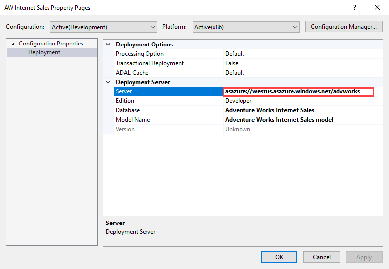
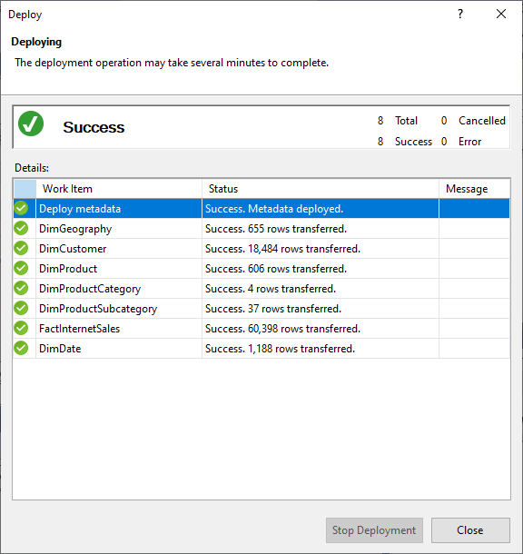
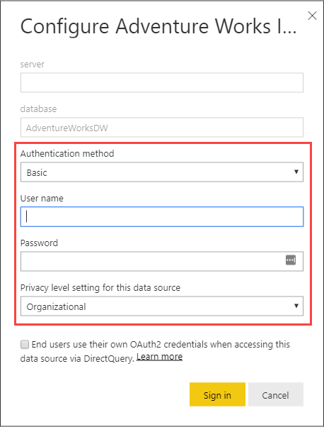
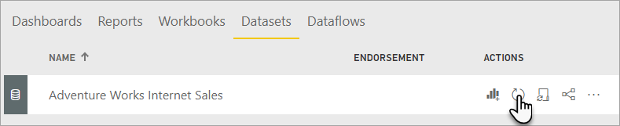

# Deploy

[!INCLUDE[appliesto-sql2019-later-aas-pbip](../includes/appliesto-sql2019-later-aas-pbip.md)]

In this lesson, you configure deployment properties by specifying an Analysis Services server or Power BI workspace to deploy to and a name for the model. You then deploy the model. After your model is deployed, users can connect to it by using a reporting client application. To learn more, see [Deploy to Azure Analysis Services](/azure/analysis-services/analysis-services-deploy) and [Tabular model solution deployment](../deployment/tabular-model-solution-deployment.md).  
  
Estimated time to complete this lesson: **5 minutes**  
  
## Prerequisites  

This article is part of a tabular modeling tutorial, which should be completed in order. Before performing the tasks in this lesson, you should have completed the previous lesson: [Lesson 12: Analyze in Excel](../tutorial-tabular-1400/as-lesson-12-analyze-in-excel.md).  

If deploying to Azure Analysis Services, you must have [Administrator permissions](/azure/analysis-services/analysis-services-server-admins) on the server.  

If deploying to Power BI Premium, you must have Admin or Contributor permission on the workspace.

If you installed the AdventureWorksDW sample database on an on-premises or VM with SQL Server, and you are deploying your model to an Azure Analysis Services server, an [On-premises data gateway](/azure/analysis-services/analysis-services-gateway) is required for the process operation to import data from the data source database into the deployed data model.
  
## Deploy the model  
  
### To configure deployment properties

1. In **Solution Explorer**, right-click the **AW Internet Sales** project, and then click **Properties**.  
  
2. In the **AW Internet Sales Property Pages** dialog box, under **Deployment Server**, in the **Server** property, enter the full server name.  
    - If deploying to Azure Analysis Services, server name is a URL. In the portal, copy the Azure Analysis Services server name URL from the server's Overview page.  
    - If deploying to a Power BI Premium workspace, server name is a Workspace Connection URL. In the Power BI service, copy from workspace Settings > Premium > Workspace Connection.

    
  
3. In the **Database** property, type **Adventure Works Internet Sales**.  
  
4. In the **Model Name** property, type **Adventure Works Internet Sales Model**.  
  
5. Verify your selections and then click **OK**.  

::: moniker range="asallproducts-allversions || azure-analysis-services-current || >= sql-analysis-services-2016"

### To deploy to Azure or SQL Server Analysis Services
  
1. In **Solution Explorer**, right-click the **AW Internet Sales** project > **Build**.  

2. Right-click the **AW Internet Sales** project > **Deploy**.

    When deploying to Azure Analysis Services, you may be prompted to enter your account. Enter your organizational account and password, for example nancy@adventureworks.com. This account must be in Admins on the server.
  
    The Deploy dialog box appears and displays the deployment status of the metadata and each table included in the model.  
    
    

3. When deployment successfully completes, go ahead and click **Close**.  

::: moniker-end

::: moniker range="asallproducts-allversions || power-bi-premium-current"

### To deploy to a Power BI Premium workspace

Deploying to a Power BI Premium workspace is a little different than deploying to SQL Server or Azure Analysis Services. When deployed the first time, a semantic model is created in the workspace by using metadata from the model.bim. As part of the deployment operation, after the model has been created in the workspace from model metadata, processing to load data from the data source into the model from data sources **will fail**.

Processing fails because unlike when deploying to an Azure or SQL Server Analysis Server server, where data source credentials are prompted for as part of the deployment operation, when deploying to a Premium workspace data source credentials cannot be specified as part of the deployment operation. Instead, after metadata deployment has succeeded and the model has been created, data source credentials are then specified in the Power BI Service in Semantic model settings. After data source credentials are specified, you can then refresh the model in the Power BI service, configure schedule refresh, or process (refresh) from SQL Server Management Studio to load data into the model.

1. In **Solution Explorer**, right-click the **AW Internet Sales** project > **Build**.  

2. Right-click the **AW Internet Sales** project > **Deploy**.

    The Deploy dialog box appears and displays the deployment status of the metadata and each table included in the model. Deploy metadata will succeed, but processing of each table **will fail**.

3. When deployment completes, go ahead and click **Close**.

4. In the Power BI Service, click **Workspaces** > workspace > **Semantic models** > **Settings** (under ACTIONS > More options) > **Data source credentials** > **Edit credentials**. Enter the username and password for your AdventureWorksDW data source.

    
    
5. In the Power BI Service, in the workspace > **Semantic models** > **Settings** (under ACTIONS), select **Refresh**. 

    

    Power BI will connect to the data source to import data into the model. Refresh will take a couple of minutes.

::: moniker-end

> [!IMPORTANT]
> If you created the Azure Synapse Analytics data source using a paid subscription, after deployment and processing\refresh is successful, to prevent unwanted charges to your account, be sure to pause or delete the resource in the portal.

This lesson describes the most common and easiest method to deploy a tabular model from Visual Studio. Advanced deployment options such as the Deployment Wizard or automating with XMLA and AMO provide greater flexibility, consistency, and scheduled deployments. To learn more, see [Tabular model solution deployment](../deployment/tabular-model-solution-deployment.md).

## Conclusion  

Congratulations! You're finished authoring and deploying your first Analysis Services tabular model. This tutorial has helped guide you through completing the most common tasks in creating a tabular model. Now that your Adventure Works Internet Sales model is deployed, you can use SQL Server Management Studio to manage the model; create process scripts and a backup plan. Users, if added to a role, can also now connect to the model using a reporting client application such as Microsoft Excel or Power BI.  

## Next step

[Connect with Power BI Desktop](/azure/analysis-services/analysis-services-connect-pbi)  
[Supplemental Lesson - Dynamic security](../tutorial-tabular-1400/as-supplemental-lesson-dynamic-security.md)  
[Supplemental Lesson - Detail rows](../tutorial-tabular-1400/as-supplemental-lesson-detail-rows.md)  
[Supplemental Lesson - Ragged hierarchies](../tutorial-tabular-1400/as-supplemental-lesson-ragged-hierarchies.md)
