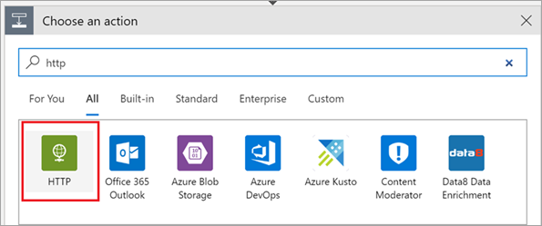
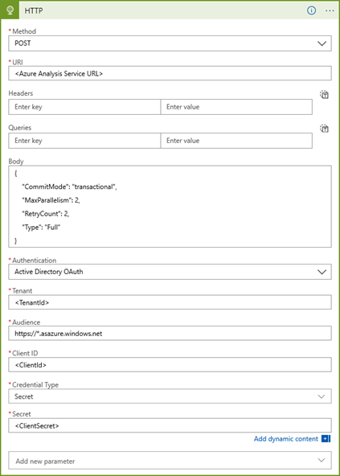
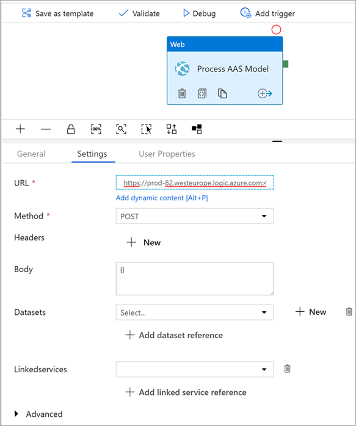
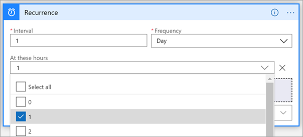

# Refresh with Logic Apps

By using Logic Apps and REST calls, you can perform automated data refresh operations on your Azure Analysis tabular models, including synchronization of read-only replicas for query scale-out.

To learn more about using REST APIs with Azure Analysis Services, see [Asynchronous refresh with the REST API](analysis-services-async-refresh.md).

## Authentication

All calls must be authenticated with a valid Microsoft Entra ID (OAuth 2) token.  The examples in this article will use a Service Principal (SPN) to authenticate to Azure Analysis Services. To learn more, see [Create a service principal by using Azure portal](../active-directory/develop/howto-create-service-principal-portal.md).

## Design the logic app

> [!IMPORTANT]
> The following examples assume that the Azure Analysis Services firewall is disabled. If the firewall is enabled, the public IP address of the request initiator must be added to the approved list in the Azure Analysis Services firewall. To learn more about Azure Logic Apps IP ranges per region, see [Limits and configuration information for Azure Logic Apps](../logic-apps/logic-apps-limits-and-config.md#configuration).

### Prerequisites

#### Create a Service Principal (SPN)

To learn about creating a Service Principal, see [Create a service principal by using Azure portal](../active-directory/develop/howto-create-service-principal-portal.md).

#### Configure permissions in Azure Analysis Services
 
The Service Principal you create must have server administrator permissions on the server. To learn more, see [Add a service principal to the server administrator role](analysis-services-addservprinc-admins.md).

### Configure the Logic App

In this example, the Logic App is designed to trigger when a HTTP request is received. This will enable the use of an orchestration tool, such as Azure Data Factory, to trigger the Azure Analysis Services model refresh.

Once you have created a Logic App:

1. In the Logic App designer, choose the first action as **When a HTTP request is received**.

   

This step will populate with the HTTP POST URL once the Logic App is saved.

2. Add a new step and search for **HTTP**.  

   

   

3. Select **HTTP** to add this action.

   

Configure the HTTP activity as follows:

|Property  |Value  |
|---------|---------|
|**Method**     |POST         |
|**URI**     | https://*your server region*/servers/*aas server name*/models/*your database name*/refreshes     For example:  https:\//westus.asazure.windows.net/servers/myserver/models/AdventureWorks/refreshes|
|**Headers**     |   Content-Type, application/json          |
|**Body**     |   To learn more about forming the request body, see [Asynchronous refresh with the REST API - POST /refreshes](analysis-services-async-refresh.md#post-refreshes). |
|**Authentication**     |Active Directory OAuth         |
|**Tenant**     |Fill in your Microsoft Entra TenantId         |
|**Audience**     |https://*.asazure.windows.net         |
|**Client ID**     |Enter your Service Principal Name ClientID         |
|**Credential Type**     |Secret         |
|**Secret**     |Enter your Service Principal Name Secret         |

Example:

Now test the Logic App.  In the Logic App designer, click **Run**.

## Consume the Logic App with Azure Data Factory

Once the Logic App is saved, review the **When a HTTP request is received** activity and then copy the **HTTP POST URL** that is now generated.  This is the URL that can be used by Azure Data Factory to make the asynchronous call to trigger the Logic App.

Here's an example Azure Data Factory Web Activity that does this action.

## Use a self-contained Logic App

If you don't plan on using an Orchestration tool such as Data Factory to trigger the model refresh, you can set the logic app to trigger the refresh based on a schedule.

Using the example above, delete the first activity and replace it with a **Schedule** activity.

This example will use **Recurrence**.

Once the activity has been added, configure the Interval and Frequency, then add a new parameter and choose **At these hours**.

Select the wanted hours.

Save the Logic App.

## Next steps

[Samples](analysis-services-samples.md)  
[REST API](/rest/api/analysisservices/servers)
